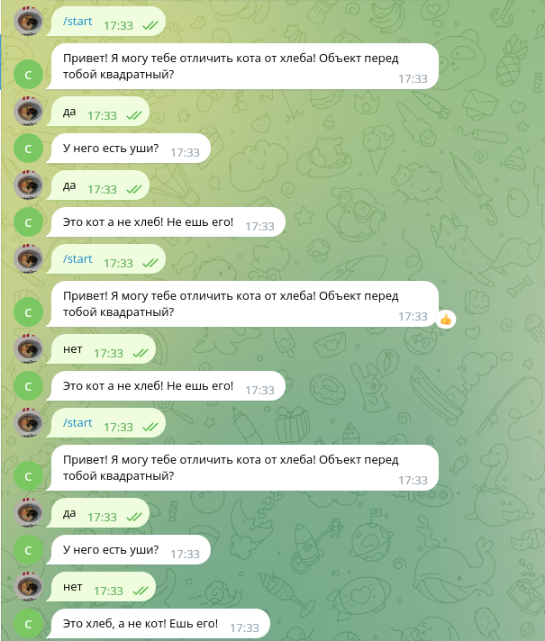
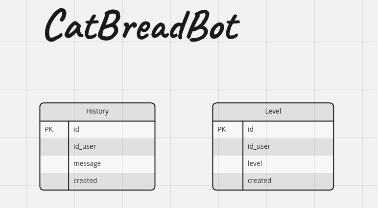

# Тестовое задание 

**Запуск локально:**
1. Для запуска необходимо создать .env файл и прописать там токен см файл .env.example 
2. Запускаем докер для postgresql:

`docker run -d \
  --name catbread-postgres-1 \
  -p 5432:5432 \
  -v $HOME/postgresql/data:/var/lib/postgresql/data \
  -e POSTGRES_PASSWORD=123qwe \
  -e POSTGRES_USER=app \
  -e POSTGRES_DB=telegrambot  \
  postgres:13` 

2. Для запуска локально нужно прописать строку подключения в env файле.\
Заходим в докер postgres\
`docker exec -it catbread-postgres-1 bash`\
`psql -h 127.0.0.1 -U app -d telegrambot` \
и выполняем последовательно команды из файла bot/fastapi_bot/db/database_bot.ddl
для создания необходимых таблиц.

3. Для запуска тестов 
`cd bot/ && python -m pytest tests`

**Запуск в docker-compouse**
1. Для запуска необходимо создать .env файл и прописать там токен см файл .env.example 
2. Запускаем docker-compouse\
`docker-compouse build`\
`docker-compouse up`

3. В контейнере выполнить команды по созданию таблиц. \
`docker exec -it catbread-postgres-1 bash`\
`psql -h 127.0.0.1 -U app -d telegrambot`
4. Выполняем последовательно команды из файла bot/fastapi_bot/db/database_bot.ddl

5. Запуск тестов в контейнере:\
`cd bot/ && python -m pytest tests`

**Пример использования**

**Схема базы данных**

